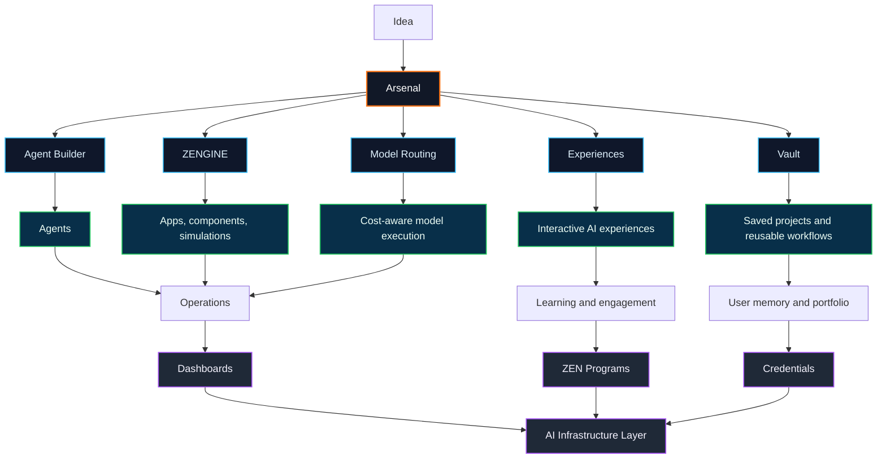

<div align="center">

<a href="https://arsenal.world">
  
</a>

<br />


<br />
<br />

<a href="https://arsenal.world">
  
</a>
<a href="https://www.zenai.world">
  
</a>
<a href="https://us.zenai.world">
  
</a>
<a href="https://alexleschik.com">
  
</a>
<a href="https://www.linkedin.com/in/alexanderleschik/">
  
</a>

</div>

```bash
alex@zen-ai-co:~$ profile --public

Identity        Founder, ZEN AI Co. | Creator, Arsenal
Thesis          AI literacy should end in deployed capability, not worksheets
Historic work   Founder of what I position as the 1st successful youth AI literacy program in US history
Operating layer Agents -> automations -> dashboards -> credentials -> ecosystem
Live system     https://arsenal.world
```

---

## Builder Signal

I build **agentic AI systems, multimodal interfaces, automation infrastructure, dashboards, credentials, and deployment-first learning systems**.

I am the founder of **ZEN AI Co.** and creator of **Arsenal**, an agent-building platform for launching AI agents, automations, full-stack tools, simulations, dashboards, and intelligent workflows from one unified surface.

I also founded what I position as the **1st successful youth AI literacy program in United States history**, where students ages **11-18** built and deployed real cloud-hosted AI agents through hands-on, deployment-first learning.

My work sits at the intersection of **AI infrastructure, education, automation, digital credentials, Web3 access, and operational systems**. The goal is simple: reduce the distance between an idea and a working system.

---

## What I'm Building

| System | Role | Public Surface |
|---|---|---|
| **Arsenal** | Agentic infrastructure for building agents, tools, automations, simulations, dashboards, workflows, and full-stack AI systems. | [arsenal.world](https://arsenal.world) |
| **ZEN AI Arena** | Unified surface for comparing, testing, and executing across major AI models. | [us.zenai.world](https://us.zenai.world) |
| **AI Pioneer Program** | Deployment-first AI literacy where students build real projects and launch cloud-hosted agents. | [zenai.world](https://www.zenai.world) |
| **ZEN Credentials** | AI x Web3 proof-of-skill infrastructure for learning, community access, token-gated access, and verified achievement. | [zenai.world](https://www.zenai.world) |
| **Smart Business Systems** | Recruiting, HR, education, business operations, internal systems, dashboards, workflows, and agentic operating layers. | [alexleschik.com](https://alexleschik.com) |

---

## Arsenal Architecture

| Layer | What It Enables |
|---|---|
| **Agent Builder** | Agents for research, operations, automation, content, systems, and execution. |
| **ZENGINE** | Components, interfaces, websites, simulations, animations, and interactive systems. |
| **Experiences** | Guided AI experiences that feel closer to interactive products than static chat. |
| **Vault** | Saved projects, outputs, prompts, files, workflows, and reusable system assets. |
| **Model Routing** | Low-cost models for simple work, stronger models for specialized execution. |
| **Ecosystem Layer** | ZEN programs, student projects, credentials, dashboards, and user growth over time. |



---

## Capability Matrix

| Domain | Current Focus |
|---|---|
| **Agentic AI** | Systems architecture, agent builders, automations, intelligent workflows, and model routing. |
| **AI Products** | Multimodal dashboards, full-stack tools, simulations, interactive experiences, and deployment surfaces. |
| **Education Infrastructure** | Youth AI literacy, deployment-first curriculum, student project launch systems, and portfolio growth. |
| **Operations** | AI workflows for recruiting, HR, education, business operations, and internal systems. |
| **Credentials + Access** | AI x Web3 proof-of-skill, token-gated access, learning verification, and digital achievement. |

<div align="center">


</div>

---

## Build Stack

<div align="center">


</div>

---

## Build Philosophy

> Deploy over theorize.  
> Reduce friction between concept and execution.  
> Build tools that expand capability for others.  
> Make AI operational, visible, and useful.  
> Treat education as infrastructure, not content.

---

## GitHub Signal

<div align="center">


<br />
<br />


</div>

---

## Links

| Destination | Link |
|---|---|
| **Arsenal** | [arsenal.world](https://arsenal.world) |
| **ZEN AI Platform** | [zenai.world](https://www.zenai.world) |
| **ZEN AI Arena** | [us.zenai.world](https://us.zenai.world) |
| **Portfolio** | [alexleschik.com](https://alexleschik.com) |
| **LinkedIn** | [linkedin.com/in/alexanderleschik](https://www.linkedin.com/in/alexanderleschik/) |
| **GitHub** | [github.com/Bluenot3](https://github.com/Bluenot3) |

---

<div align="center">

### Build systems. Launch agents. Verify skills. Expand capability.

<a href="https://arsenal.world">
  
</a>

<br />
<br />


</div>