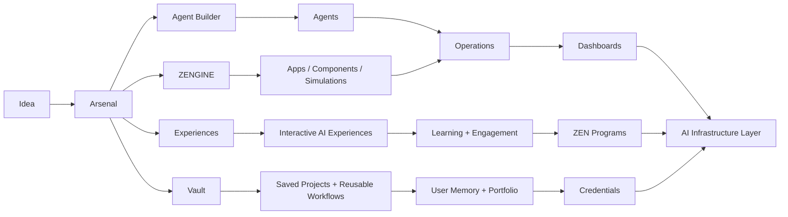

<div align="center">

<a href="https://arsenal.world">
  
</a>

<br />


<br />
<br />

<a href="https://arsenal.world">
  
</a>
<a href="https://www.zenai.world">
  
</a>
<a href="https://us.zenai.world">
  
</a>
<a href="https://alexleschik.com">
  
</a>
<a href="https://www.linkedin.com/in/alexanderleschik/">
  
</a>
<a href="https://github.com/Bluenot3">
  
</a>

<br />
<br />

</div>

```bash
alex@zen-ai-co:~$ ./launch_arsenal.sh

> Identity:       Founder of ZEN AI Co.
> Flagship:       Arsenal — agentic infrastructure for building and launching AI systems
> Historic Work:  Founder of the 1st Youth AI Literacy Program in United States history
> Thesis:         AI literacy should end in deployment, not worksheets
> Direction:      Agents → Automations → Dashboards → Credentials → Ecosystem
> Live System:    https://arsenal.world
```

---

## ⟁ About

I build **agentic AI systems, multimodal interfaces, automation infrastructure, and deployment-first learning systems**.

I am the founder of **ZEN AI Co.** and creator of **Arsenal**, an agent-building platform designed to help people create and launch AI agents, automations, full-stack tools, simulations, dashboards, and intelligent workflows from one unified surface.

I also founded what I position as the **1st successful youth AI literacy program in United States history**, where students ages 11–18 built and deployed real, cloud-hosted AI agents through hands-on, deployment-first learning.

My work sits at the intersection of **AI infrastructure, education, automation, digital credentials, and operational systems**. The goal is simple: reduce the distance between an idea and a working system.

---

## ⚔️ Flagship System: Arsenal

<div align="center">

<a href="https://arsenal.world">
  
</a>

<br />

<a href="https://arsenal.world">
  
</a>

</div>

<br />

**Arsenal** is agentic infrastructure for building, launching, and organizing AI agents, full-stack tools, automations, simulations, dashboards, and intelligent workflows.

| Layer | What Arsenal Enables |
|---|---|
| **Agent Builder** | Create agents for research, operations, automation, content, systems, and execution |
| **ZENGINE** | Build components, interfaces, websites, simulations, animations, and interactive systems |
| **Experiences** | Generate guided AI experiences that feel closer to interactive products than static chat |
| **Vault** | Save projects, outputs, prompts, files, workflows, and reusable system assets |
| **Model Routing** | Use low-cost models for simple tasks and stronger models for specialized execution |
| **Ecosystem Layer** | Connect ZEN programs, student projects, credentials, dashboards, and user growth over time |

---

## 🧩 ZEN Ecosystem

<table>
<tr>
<td width="50%" valign="top">

### ⚔️ Arsenal  
Agentic infrastructure for building agents, tools, automations, simulations, dashboards, and full-stack AI systems.

**Live:** [arsenal.world](https://arsenal.world)

</td>
<td width="50%" valign="top">

### 🧠 ZEN AI Arena  
A unified surface for comparing, testing, and executing across major AI models.

**Live:** [us.zenai.world](https://us.zenai.world)

</td>
</tr>
<tr>
<td width="50%" valign="top">

### 🚀 AI Pioneer Program  
Deployment-first youth AI literacy where students build real projects and launch cloud-hosted AI agents.

**Platform:** [zenai.world](https://www.zenai.world)

</td>
<td width="50%" valign="top">

### ⛓️ AI × Web3 Credentials  
Portable proof-of-skill infrastructure for learning, community access, and verified achievement.

**Ecosystem:** [zenai.world](https://www.zenai.world)

</td>
</tr>
</table>

---

## 🗺️ System Map



---

## 🔥 Highlights

- Founder of **ZEN AI Co.**
- Creator of **Arsenal**, an agent-building platform for launching AI agents, automations, full-stack tools, simulations, and interactive systems
- Founder of what I position as the **1st successful youth AI literacy program in United States history**
- Builder of agentic systems, AI dashboards, multimodal interfaces, and operational automation workflows
- Developed AI-powered workflows for recruiting, HR, education, business operations, and internal systems
- Building AI × Web3 infrastructure for credentials, token-gated access, learning verification, and digital achievement
- Building the **ZEN AI Arena** as a unified surface for model access, comparison, and execution

---

## 🧠 Current Focus

```text
01. Arsenal
    Agentic infrastructure for building agents, tools, automations, experiences, simulations, and apps.

02. ZEN AI Arena
    Unified AI model access, comparison, and execution.

03. AI Pioneer Program
    Deployment-first AI literacy where students produce real cloud-hosted AI projects.

04. ZEN Credentials
    AI × Web3 proof-of-skill infrastructure.

05. Smart Business Systems
    Automation systems, dashboards, workflows, and agentic operating layers for organizations.
```

---

## 🛠️ Systems & Domains

<div align="center">


</div>

---

## ⚙️ Build Stack

<div align="center">


</div>

---

## ⛓️ Build Philosophy

> Deploy over theorize.  
> Reduce friction between concept and execution.  
> Build tools that expand capability for others.  
> Make AI operational, visible, and useful.  
> Treat education as infrastructure, not content.

---

## 📡 Public Links

| Destination | Link |
|---|---|
| **Arsenal** | [arsenal.world](https://arsenal.world) |
| **ZEN AI Platform** | [zenai.world](https://www.zenai.world) |
| **ZEN AI Arena** | [us.zenai.world](https://us.zenai.world) |
| **Portfolio** | [alexleschik.com](https://alexleschik.com) |
| **LinkedIn** | [linkedin.com/in/alexanderleschik](https://www.linkedin.com/in/alexanderleschik/) |
| **GitHub** | [github.com/Bluenot3](https://github.com/Bluenot3) |

---

## GitHub Signal

<div align="center">


</div>

---

<div align="center">


</div>

---

<div align="center">

### Build systems. Launch agents. Verify skills. Expand capability.

<a href="https://arsenal.world">
  
</a>

<br />
<br />


</div>
