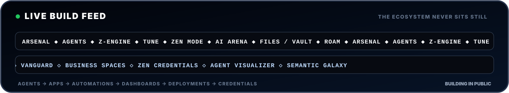

 

 
 

<strong>Founder, ZEN AI Co. · Creator, Arsenal · Washington, D.C.</strong> 
I design agentic systems people can use, own, and prove.

## Presidential AI Challenge recognition

&nbsp;&nbsp;

 
<strong>Certificate wording:</strong> “In recognition of your contribution to the 2026 Presidential AI Challenge.” · <a href="./evidence/presidential-ai-challenge-2026.pdf">View the original certificate</a>

## Choose your door

<a href="https://arsenal.world/?utm_source=github&amp;utm_medium=profile&amp;utm_campaign=alex_leschik_v2&amp;utm_content=three_doors"><strong>BUILD IN ARSENAL</strong></a>
&nbsp;&nbsp;&nbsp;·&nbsp;&nbsp;&nbsp;
<a href="https://www.zenai.world/us-world-first-youth-ai-literacy?utm_source=github&amp;utm_medium=profile&amp;utm_campaign=alex_leschik_v2&amp;utm_content=three_doors"><strong>EXPLORE AI PIONEER</strong></a>
&nbsp;&nbsp;&nbsp;·&nbsp;&nbsp;&nbsp;
<a href="mailto:huxley@zenai.biz?subject=Build%20with%20ZEN%20via%20GitHub"><strong>BUILD A BUSINESS SYSTEM</strong></a>

---

I’m **Alex Leschik**. I build the infrastructure between an idea and a working system.

That means agents that execute, interfaces that make intelligence usable, automations that preserve human control, programs that end in deployed artifacts, and business systems that can prove what changed.

> **The thesis:** capability beats content. Outcomes beat outputs. Ownership beats dependency.

## What lives inside the system

| Layer | Systems | What leaves the screen |
|---|---|---|
| **Create** | Arsenal · Agents · Z-ENGINE · Tune · Zen Mode · ZEN AI Arena | Agents, apps, tools, simulations, interfaces, multimodal outputs. |
| **Operate** | Business Spaces · Automations · Dashboards · Model Routing | Governed workflows, approvals, work queues, operational evidence, measurable results. |
| **Learn** | AI Pioneer · Vanguard · ZEN Credentials | Student-built agents, apps, games, dashboards, deployments, portfolios, proof of skill. |
| **Own** | Files / Vault · Projects · Export · GitHub / Hugging Face handoff | Persistent artifacts that remain usable beyond a single session. |
| **Inspect** | ROAM / Instant Website X-Ray | Deterministic, explainable website intelligence without unnecessary paid dependencies. |

<strong>Open the granular capability index</strong>

 

- **Arsenal:** unified creation and execution surface for agents, apps, automations, dashboards, simulations, and full-stack systems.
- **Z-ENGINE:** generative build engine for interfaces, websites, components, and interactive experiences.
- **Tune:** refinement layer for improving prompts, behavior, assets, and system quality.
- **Zen Mode:** focused multimodal creation, deliberately separate from protected course-completion logic.
- **ZEN AI Arena:** model access, comparison, testing, and execution across major AI systems.
- **Files / Vault:** creation, preview, persistence, export, download, ownership, and builder handoff.
- **Business Spaces:** teams, agents, files, shifts, dashboards, memory, work queues, approvals, replay, client delivery, and ROI evidence.
- **AI Pioneer:** deployment-first AI literacy for ages 11–18 built around real learner action and proof artifacts.
- **Vanguard:** advanced builder progression and higher-complexity systems work.
- **ZEN Credentials:** portable proof attached to completed capability.
- **ROAM:** deterministic, low/no-cost website inspection and opportunity mapping.
- **Model routing:** cost-aware execution across text, code, image, video, and specialized workloads with fallbacks and visible errors.

## Built in public

| Live surface | Why it exists |
|---|---|
| [**Arsenal**](https://arsenal.world/?utm_source=github&utm_medium=profile&utm_campaign=alex_leschik_v2&utm_content=live_surface) | Build and deploy agentic systems from one operating surface. |
| [**ZEN AI Co.**](https://www.zenai.world/?utm_source=github&utm_medium=profile&utm_campaign=alex_leschik_v2&utm_content=live_surface) | Programs, credentials, experiments, playgrounds, and the wider ZEN ecosystem. |
| [**AI Pioneer Program**](https://www.zenai.world/us-world-first-youth-ai-literacy?utm_source=github&utm_medium=profile&utm_campaign=alex_leschik_v2&utm_content=live_surface) | Deployment-first AI literacy for young builders ages 11–18. |
| [**Agent Visualizer**](https://www.zenai.world/agentviz?utm_source=github&utm_medium=profile&utm_campaign=alex_leschik_v2&utm_content=live_surface) | A public experiment for making agent systems visible and understandable. |
| [**Alexander Leschik**](https://www.alexleschik.com/?utm_source=github&utm_medium=profile&utm_campaign=alex_leschik_v2&utm_content=live_surface) | Selected product, systems, AI, and operator work. |

## Bring me the right kind of problem

| If you have… | I’m interested in… | Start here |
|---|---|---|
| A product idea that should already exist | Turning it into an agent, interface, workflow, or deployable system. | [Enter Arsenal](https://arsenal.world/?utm_source=github&utm_medium=profile&utm_campaign=alex_leschik_v2&utm_content=problem_table) |
| An operational bottleneck or revenue leak | Designing a controlled loop: signal → approval → action → evidence. | [Build with ZEN](mailto:huxley@zenai.biz?subject=Arsenal%20Business%20System%20via%20GitHub) |
| A student, school, or learning partner ready to build | Replacing passive AI content with deployed projects and proof of capability. | [Explore AI Pioneer](https://www.zenai.world/us-world-first-youth-ai-literacy?utm_source=github&utm_medium=profile&utm_campaign=alex_leschik_v2&utm_content=problem_table) |
| A belief in public experimentation | Supporting the continued development of tools, demos, and open work. | [Sponsor the build](https://github.com/sponsors/Bluenot3) |

## GitHub signal

 
 

---

 

<a href="https://arsenal.world/?utm_source=github&amp;utm_medium=profile&amp;utm_campaign=alex_leschik_v2&amp;utm_content=footer"><strong>ARSENAL</strong></a>
&nbsp;&nbsp;·&nbsp;&nbsp;
<a href="https://www.zenai.world/?utm_source=github&amp;utm_medium=profile&amp;utm_campaign=alex_leschik_v2&amp;utm_content=footer"><strong>ZEN AI CO.</strong></a>
&nbsp;&nbsp;·&nbsp;&nbsp;
<a href="https://www.linkedin.com/in/alexanderleschik/"><strong>LINKEDIN</strong></a>
&nbsp;&nbsp;·&nbsp;&nbsp;
<a href="https://x.com/ZEN_AGI"><strong>@ZEN_AGI</strong></a>
&nbsp;&nbsp;·&nbsp;&nbsp;
<a href="https://github.com/sponsors/Bluenot3"><strong>SPONSOR</strong></a>

