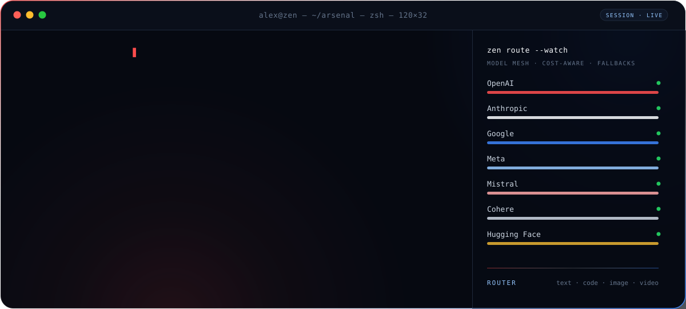
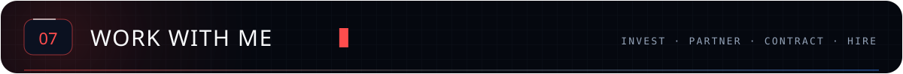
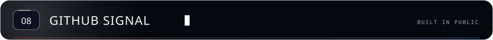
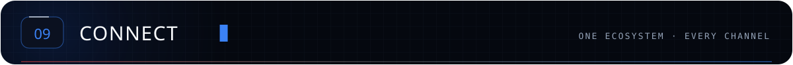

 

 

I founded **ZEN AI Co.**, which runs the **AI Pioneer Program** with **Boys & Girls Clubs of Greater Washington**: the first youth AI literacy program in United States history, now heading into its **fourth consecutive year in 2027** and expanding. At the same time I'm shipping **[Arsenal](https://arsenal.world/?utm_source=github&utm_medium=profile&utm_campaign=alex_leschik_v3&utm_content=signal_copy)**, a custom agentic and generative AI platform for businesses, professionals, entrepreneurs and citizens.

 

I'm **Alex Leschik**. I build the infrastructure between an idea and a working system: agents that execute, interfaces that make intelligence usable, automations that keep humans in control, learning programs that end in deployed artifacts, and business systems that can prove what changed.

> **The thesis:** capability beats content. Outcomes beat outputs. Ownership beats dependency.

 

  
  
  
  
  
  

<strong>Open the full ecosystem index</strong>

 

| Build & operate | Create & explore | Learn & compete | Signal & community |
|---|---|---|---|
| [**Arsenal**](https://arsenal.world) Agent + app builder | [**ZEN Pen**](https://www.zenai.world/zen-pen) AI writing system | [**AI Pioneer Program**](https://www.zenai.world/ailiteracyyouth) Youth AI literacy | [**ZEN Weekly**](https://www.zenai.world/zenweekly/categories/zen-weekly) Research + intelligence |
| [**ZEN AI Arena**](https://us.zenai.biz/) Models + agents | [**Vibe Book**](https://www.zenai.world/vibe-book) Creative AI system | [**Challenges**](https://www.zenai.world/challenges) Programs hub | [**ZEN Blog**](https://www.zenai.world/blog) Notes from the build |
| [**Qubit**](https://qubit.earth) Business agent platform | [**Agent Visualizer**](https://www.zenai.world/agentviz) See agent systems think | [**Leaderboard**](https://www.zenai.world/leaderboard) Community ranking | [**Media Hub**](https://www.zenai.world/media) Video + press |
| [**ZEN Solutions**](https://www.zenai.world/solutions) Enterprise + business AI | [**ZEN Avatar**](https://www.zenai.world/zenavatar) Identity layer | [**AI Pioneer Community**](https://www.zenai.world/group/ai-pioneer-program/discussion) Student builders | [**Groups**](https://www.zenai.world/groups) ZEN groups hub |
| [**ZEN Tools**](https://www.zenai.world/tools) AI utilities | [**Life-in-Time**](https://www.zenai.world/life-in-time) Data + visualization | [**Parent Portal**](https://www.zenai.world/group/parent-portal/discussion) For families | [**Search**](https://www.zenai.world/search) Full platform index |
| [**Dynamic Analytics**](https://www.zenai.world/dynamicanalytics) Dashboards + analytics | [**ZEN Periodic**](https://www.zenai.world/periodic) Knowledge system | | [**Blockchain Mining**](https://t.me/herewalletbot/app?startapp=4226714-village-100650) Community on Telegram |
| [**Pricing**](https://arsenal.world/pricing) Arsenal plans | [**ZEN Physics**](https://www.zenai.world/physics) Advanced concepts | | [**zenai.world**](https://www.zenai.world/) The whole ecosystem |

 

Deployment-first AI literacy for ages 11–18. Students don't watch AI, they **ship** it: agents, apps, games and dashboards built with frontier models, deployed to the cloud, collected in a public portfolio, and backed by a portable ZEN Credential.

  <a href="https://www.zenai.world/ailiteracyyouth?utm_source=github&amp;utm_medium=profile&amp;utm_campaign=alex_leschik_v3&amp;utm_content=pioneer_links"><strong>EXPLORE THE PROGRAM</strong></a>
  &nbsp;·&nbsp;
  <a href="https://www.zenai.world/group/ai-pioneer-program/discussion"><strong>PIONEER COMMUNITY</strong></a>
  &nbsp;·&nbsp;
  <a href="https://www.zenai.world/group/parent-portal/discussion"><strong>PARENT PORTAL</strong></a>
  &nbsp;·&nbsp;
  <a href="https://www.zenai.world/challenges"><strong>CHALLENGES</strong></a>

 

Certificate wording: “In recognition of your contribution to the 2026 Presidential AI Challenge.” · <a href="./evidence/presidential-ai-challenge-2026.pdf">View the original certificate (PDF)</a>

 

| Layer | Systems | What leaves the screen |
|---|---|---|
| **Create** | Arsenal · Agents · Z-ENGINE · Tune · Zen Mode · ZEN AI Arena | Agents, apps, tools, simulations, interfaces, multimodal outputs. |
| **Operate** | Business Spaces · Automations · Dashboards · Model Routing | Governed workflows, approvals, work queues, operational evidence, measurable results. |
| **Learn** | AI Pioneer · Vanguard · ZEN Credentials | Student-built agents, apps, games, dashboards, deployments, portfolios, proof of skill. |
| **Own** | Files / Vault · Projects · Export · GitHub / Hugging Face handoff | Persistent artifacts that remain usable beyond a single session. |
| **Inspect** | ROAM / Instant Website X-Ray | Deterministic, explainable website intelligence without unnecessary paid dependencies. |

<strong>Open the granular capability index</strong>

 

- **Arsenal:** unified creation and execution surface for agents, apps, automations, dashboards, simulations, and full-stack systems.
- **Z-ENGINE:** generative build engine for interfaces, websites, components, and interactive experiences.
- **Tune:** refinement layer for improving prompts, behavior, assets, and system quality.
- **Zen Mode:** focused multimodal creation, deliberately separate from protected course-completion logic.
- **ZEN AI Arena:** model access, comparison, testing, and execution across major AI systems.
- **Qubit:** agent platform built for business operators.
- **Files / Vault:** creation, preview, persistence, export, download, ownership, and builder handoff.
- **Business Spaces:** teams, agents, files, shifts, dashboards, memory, work queues, approvals, replay, client delivery, and ROI evidence.
- **AI Pioneer:** deployment-first AI literacy for ages 11–18 built around real learner action and proof artifacts.
- **Vanguard:** advanced builder progression and higher-complexity systems work.
- **ZEN Credentials:** portable proof attached to completed capability.
- **ROAM:** deterministic, low/no-cost website inspection and opportunity mapping.
- **Model routing:** cost-aware execution across text, code, image, video, and specialized workloads with fallbacks and visible errors.

 

| If you are… | What I bring | Start here |
|---|---|---|
| **An investor** | A founder with a live agentic platform, a first-in-history youth program, and a Boys & Girls Clubs of Greater Washington partnership entering its fourth year. | [Start the conversation](mailto:huxley@zenai.biz?subject=Investing%20in%20ZEN%20AI%20Co.%20(via%20GitHub)) |
| **A partner or sponsor** | AI literacy that ends in deployed work and measurable outcomes, ready to scale to new cities, clubs and districts. | [Partner with ZEN](mailto:huxley@zenai.biz?subject=AI%20Pioneer%20Partnership%20(via%20GitHub)) |
| **Hiring or contracting** | Someone who takes an idea to a governed, working system: agents, interfaces, automations and the evidence they worked. | [Book the build](mailto:huxley@zenai.biz?subject=Build%20with%20ZEN%20(via%20GitHub)) |
| **Sitting on an operational bottleneck** | A controlled loop: signal → approval → action → evidence. | [Enter Arsenal](https://arsenal.world/?utm_source=github&utm_medium=profile&utm_campaign=alex_leschik_v3&utm_content=work_table) |
| **Believing in building in public** | Continued development of open tools, demos and experiments. | [Sponsor the build](https://github.com/sponsors/Bluenot3) |

 

 
 

 

  
  
  
  
  
  
  
  
  

 

<strong>How this profile is engineered</strong>

 

Every visual on this page is a hand-built, self-contained animated SVG generated by [`scripts/build_profile_assets.py`](./scripts/build_profile_assets.py). No GIFs, no video, no JavaScript, no external requests:

- **Fonts** (Unbounded, JetBrains Mono, Inter; SIL OFL) are subset to the exact glyphs each file uses and embedded as WOFF2.
- **The ZZ monogram** is vector geometry traced from the master mark, laser-drawn with `stroke-dashoffset` while a spark rides the outline via `animateMotion`.
- **The globe** is ~2,900 dots (about 1,200 of them land, from Natural Earth). Each latitude ring is one path on a unit circle, projected with `scale(r, r·sin(tilt))` and spun with a single `animateTransform`. `non-scaling-stroke` keeps the dots round, and a per-ring clip at the true horizon hides the far side. 45 rotations draw the whole planet, and the D.C. label counter-rotates so it stays upright.
- **Motion** is CSS keyframes plus SMIL: odometer digit columns, typed terminal clips, orbiting satellites. CSS motion honors `prefers-reduced-motion`.
- **Rendering budget:** no blur filters on anything that moves, so repaint stays cheap.

