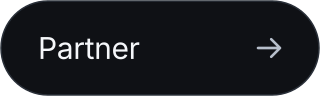
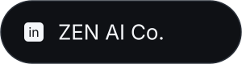

<a href="https://arsenal.world/?utm_source=github&amp;utm_medium=profile&amp;utm_campaign=alex_leschik_v4&amp;utm_content=hero">
  <picture>
    <source media="(max-width: 600px)" srcset="./assets/profile/hero-m.svg" />
    
  </picture>
</a>

 

<a href="mailto:huxley@zenai.biz?subject=Partnering%20with%20ZEN%20AI%20Co.%20(via%20GitHub)"></a>
<a href="https://alexleschik.com/?utm_source=github&amp;utm_medium=profile&amp;utm_campaign=alex_leschik_v4&amp;utm_content=cta"></a>

 

I'm **Alex Leschik**, founder of **ZEN AI Co.** I build the layer between an idea and a working system: agents that execute, interfaces that make models usable, and automations that keep people in control. Today that means shipping **[Arsenal](https://arsenal.world/?utm_source=github&utm_medium=profile&utm_campaign=alex_leschik_v4&utm_content=intro)**, our agentic and generative AI platform for businesses, professionals, entrepreneurs and citizens, and running the **AI Pioneer Program** with Boys & Girls Clubs of Greater Washington.

 

<picture>
  <source media="(max-width: 600px)" srcset="./assets/profile/section-01-m.svg" />
  
</picture>

<a href="https://www.zenai.world/ailiteracyyouth?utm_source=github&amp;utm_medium=profile&amp;utm_campaign=alex_leschik_v4&amp;utm_content=impact">
  <picture>
    <source media="(max-width: 600px)" srcset="./assets/profile/signal-m.svg" />
    
  </picture>
</a>

 
 

<picture>
  <source media="(max-width: 600px)" srcset="./assets/profile/section-02-m.svg" />
  
</picture>

<a href="https://www.zenai.world/?utm_source=github&amp;utm_medium=profile&amp;utm_campaign=alex_leschik_v4&amp;utm_content=system_map">
  <picture>
    <source media="(max-width: 600px)" srcset="./assets/profile/ecosystem-m.svg" />
    
  </picture>
</a>

  <a href="https://arsenal.world/?utm_source=github&amp;utm_medium=profile&amp;utm_campaign=alex_leschik_v4&amp;utm_content=tile"></a>
  <a href="https://us.zenai.biz/?utm_source=github&amp;utm_medium=profile&amp;utm_campaign=alex_leschik_v4&amp;utm_content=tile"></a>
  <a href="https://qubit.earth/?utm_source=github&amp;utm_medium=profile&amp;utm_campaign=alex_leschik_v4&amp;utm_content=tile"></a>
  <a href="https://www.zenai.world/ailiteracyyouth?utm_source=github&amp;utm_medium=profile&amp;utm_campaign=alex_leschik_v4&amp;utm_content=tile"></a>
  <a href="https://www.zenai.world/solutions?utm_source=github&amp;utm_medium=profile&amp;utm_campaign=alex_leschik_v4&amp;utm_content=tile"></a>
  <a href="https://www.zenai.world/tools?utm_source=github&amp;utm_medium=profile&amp;utm_campaign=alex_leschik_v4&amp;utm_content=tile"></a>

<strong>How the platform fits together</strong>

 

- **Create.** Arsenal, Z-ENGINE, Tune, Zen Mode and ZEN AI Arena turn an idea into agents, apps, tools, simulations and interfaces, with model access across every major lab.
- **Operate.** Business Spaces, automations, dashboards and cost-aware model routing run governed workflows: teams, work queues, approvals, replay and measurable results.
- **Learn.** AI Pioneer, Vanguard and ZEN Credentials turn student work into real deployments, public portfolios and portable proof of skill.
- **Own.** Files / Vault, projects, export, and GitHub or Hugging Face handoff keep every artifact usable beyond a single session.
- **Inspect.** ROAM, an instant website X-ray: deterministic, explainable website intelligence without paid dependencies.

<strong>Every ZEN product and channel</strong>

 

**Build & operate** · [Arsenal](https://arsenal.world) · [ZEN AI Arena](https://us.zenai.biz/) · [Qubit](https://qubit.earth) · [ZEN Solutions](https://www.zenai.world/solutions) · [ZEN Tools](https://www.zenai.world/tools) · [Dynamic Analytics](https://www.zenai.world/dynamicanalytics) · [Pricing](https://arsenal.world/pricing)

**Create & explore** · [ZEN Pen](https://www.zenai.world/zen-pen) · [Vibe Book](https://www.zenai.world/vibe-book) · [Agent Visualizer](https://www.zenai.world/agentviz) · [ZEN Avatar](https://www.zenai.world/zenavatar) · [Life-in-Time](https://www.zenai.world/life-in-time) · [ZEN Periodic](https://www.zenai.world/periodic) · [ZEN Physics](https://www.zenai.world/physics)

**Learn & compete** · [AI Pioneer Program](https://www.zenai.world/ailiteracyyouth) · [Challenges](https://www.zenai.world/challenges) · [Leaderboard](https://www.zenai.world/leaderboard) · [Pioneer community](https://www.zenai.world/group/ai-pioneer-program/discussion) · [Parent portal](https://www.zenai.world/group/parent-portal/discussion)

**Signal & community** · [ZEN Weekly](https://www.zenai.world/zenweekly/categories/zen-weekly) · [Blog](https://www.zenai.world/blog) · [Media](https://www.zenai.world/media) · [Groups](https://www.zenai.world/groups) · [Search](https://www.zenai.world/search) · [Blockchain mining community](https://t.me/herewalletbot/app?startapp=4226714-village-100650) · [zenai.world](https://www.zenai.world/)

 

<picture>
  <source media="(max-width: 600px)" srcset="./assets/profile/section-03-m.svg" />
  
</picture>

<a href="https://www.zenai.world/ailiteracyyouth?utm_source=github&amp;utm_medium=profile&amp;utm_campaign=alex_leschik_v4&amp;utm_content=pioneer">
  <picture>
    <source media="(max-width: 600px)" srcset="./assets/profile/pioneer-m.svg" />
    
  </picture>
</a>

  <a href="https://www.zenai.world/ailiteracyyouth?utm_source=github&amp;utm_medium=profile&amp;utm_campaign=alex_leschik_v4&amp;utm_content=pioneer_links">Explore the program</a>
  &nbsp;·&nbsp;
  <a href="https://www.zenai.world/group/ai-pioneer-program/discussion">Pioneer community</a>
  &nbsp;·&nbsp;
  <a href="https://www.zenai.world/group/parent-portal/discussion">Parent portal</a>
  &nbsp;·&nbsp;
  <a href="https://www.zenai.world/challenges">Challenges</a>

 

<picture>
  <source media="(max-width: 600px)" srcset="./assets/profile/section-04-m.svg" />
  
</picture>

<a href="./evidence/presidential-ai-challenge-2026.pdf">
  <picture>
    <source media="(max-width: 600px)" srcset="./assets/profile/credential-m.svg" />
    
  </picture>
</a>

 
 

<picture>
  <source media="(max-width: 600px)" srcset="./assets/profile/section-05-m.svg" />
  
</picture>

- **Investors.** A live agentic platform and a first-of-its-kind youth program entering its fourth year with Boys & Girls Clubs of Greater Washington. [Start a conversation →](mailto:huxley@zenai.biz?subject=Investing%20in%20ZEN%20AI%20Co.%20(via%20GitHub))
- **Partners and sponsors.** AI literacy that ends in deployed work and measurable outcomes, ready for new cities, clubs and districts. [Partner with ZEN →](mailto:huxley@zenai.biz?subject=AI%20Pioneer%20Partnership%20(via%20GitHub))
- **Teams and companies.** An idea taken all the way to a governed, working system: agents, interfaces, automations, and evidence that they worked. [Start a build →](mailto:huxley@zenai.biz?subject=Build%20with%20ZEN%20(via%20GitHub))
- **Operators.** A bottleneck turned into a controlled loop: signal, approval, action, evidence. [Try Arsenal →](https://arsenal.world/?utm_source=github&utm_medium=profile&utm_campaign=alex_leschik_v4&utm_content=work)
- **Builders.** Open tools, demos and experiments, developed in public. [Sponsor the work →](https://github.com/sponsors/Bluenot3)

 

<picture>
  <source media="(max-width: 600px)" srcset="./assets/profile/section-06-m.svg" />
  
</picture>

  
  
  <a href="https://www.linkedin.com/company/z3nai"></a>
  
  
  
  
  
  

 

<a href="https://www.zenai.world/?utm_source=github&amp;utm_medium=profile&amp;utm_campaign=alex_leschik_v4&amp;utm_content=footer">
  <picture>
    <source media="(max-width: 600px)" srcset="./assets/profile/footer-m.svg" />
    
  </picture>
</a>

<strong>How this profile is built</strong>

 

Every visual here is a self-contained animated SVG generated by [`scripts/build_profile_assets.py`](./scripts/build_profile_assets.py). No GIFs, no video, no JavaScript, no external requests.

- **Responsive.** Wide graphics ship a portrait phone layout too, served with `<picture>` and a `max-width: 600px` media query, so type stays readable on a phone. Buttons, tiles and links use fixed heights so they reflow into a grid instead of shrinking.
- **Type.** Inter Display, Instrument Serif and JetBrains Mono (SIL OFL), subset to the exact glyphs each file uses and embedded as WOFF2.
- **The globe.** About 2,500 dots, roughly 1,400 of them land from Natural Earth. Each latitude ring is one path on a unit circle, projected with `scale(r, r·sin(tilt))` and spun by a single `animateTransform`; `non-scaling-stroke` keeps the dots round, and a per-ring clip at the true horizon hides the far side. Flight arcs from Washington, D.C. are elevated great circles, re-projected every 5° of rotation into keyframed Bézier paths so they ride the spinning planet and fade at the limb.
- **Motion.** CSS keyframes and SMIL only: one-shot entrances, odometer counters with live mini-charts, a radar sweep that pings each product as it passes, a laser-traced monogram. Everything honors `prefers-reduced-motion`, and nothing that moves uses a blur filter.

